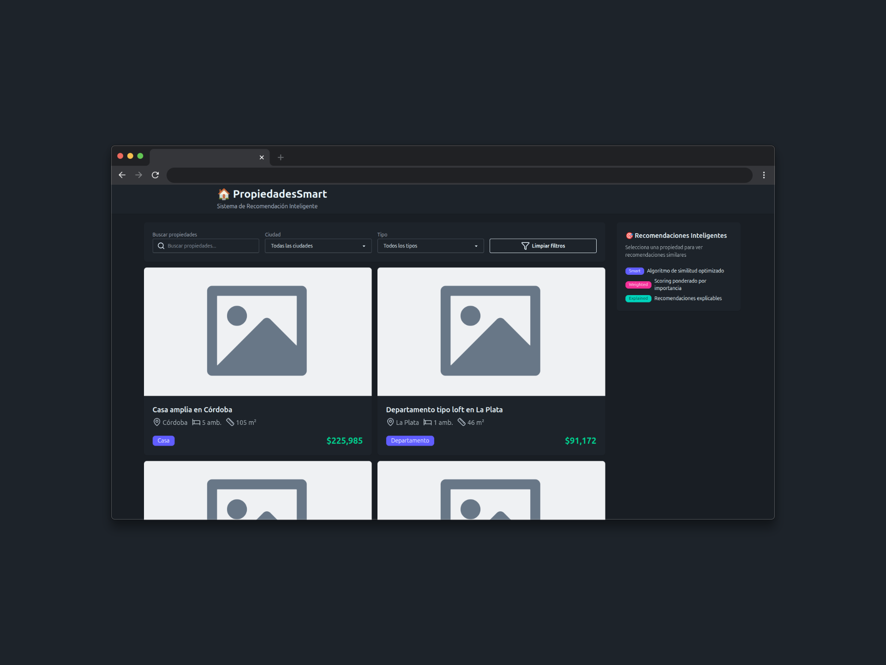

<!-- Banner -->
<p align="center">
  
</p>

<!-- Badges -->
<p align="center">
  
  
  
  
  
  
</p>

# Recommender Property App

Un sistema inteligente de recomendación inmobiliaria construido con React, TypeScript y Vite.

## Características

- **Motor de Recomendación de Propiedades:** Sugiere propiedades similares según ciudad, tipo, precio, tamaño y ambientes.
- **Puntaje Ponderado:** Cada atributo tiene un peso para una recomendación más precisa.
- **Recomendaciones Explicables:** Cada recomendación incluye razones (como pares clave/valor) para mayor transparencia.
- **Filtrado y Búsqueda:** Filtra propiedades por ciudad, tipo y término de búsqueda.
- **Paginación:** Navega por las propiedades con resultados paginados.
- **Estadísticas de Mercado:** Consulta el contexto de mercado para cada propiedad (precio promedio, posición, etc.).
- **UI Moderna:** Construido con Tailwind CSS y DaisyUI.

## Stack Tecnológico

- [React 19](https://react.dev/)
- [TypeScript](https://www.typescriptlang.org/)
- [Vite](https://vitejs.dev/)
- [Tailwind CSS](https://tailwindcss.com/)
- [DaisyUI](https://daisyui.com/)
- [Lucide React Icons](https://lucide.dev/icons/)

## Comenzando

### Requisitos

- Node.js (recomendado v18+)
- npm o yarn

### Instalación

```bash
git clone https://github.com/adiazt01/recommender-property-app.git
cd recommender-property-app
npm install
# o
yarn install
```

### Desarrollo

```bash
npm run dev
# o
yarn dev
```

Abre [http://localhost:5173](http://localhost:5173) en tu navegador.

### Build

```bash
npm run build
# o
yarn build
```

### Lint

```bash
npm run lint
# o
yarn lint
```

## Estructura del Proyecto

```
src/
  features/
    core/
      algorithms/
      components/
      constants/
      hooks/
      interface/
      types/
    properties/
      components/
      context/
      hooks/
      interface/
      mappers/
      services/
  utils/
    recomendation.util.ts
  data/
    properties.json
```

## Motor de Recomendación

- El motor utiliza un sistema de puntaje ponderado para comparar propiedades.
- Cada recomendación incluye un objeto `reasons` con claves como `same_city`, `similar_price`, etc., y sus valores correspondientes.
- Puedes personalizar los pesos y umbrales en `src/features/core/constants/recommendationWeightConstants.ts`.

## Alias

- `@/` → `src/`
- `@core/` → `src/features/core/`
- `@properties/` → `src/features/properties/`

## Ejemplo de Uso

```typescript
import { SmartRecommendationEngine } from "@/utils/recomendation.util";
import { getProperties } from "@properties/services/propertyService";

const properties = getProperties();
const engine = new SmartRecommendationEngine(properties);
const recommendations = engine.getRecommendations(properties[0]);
```